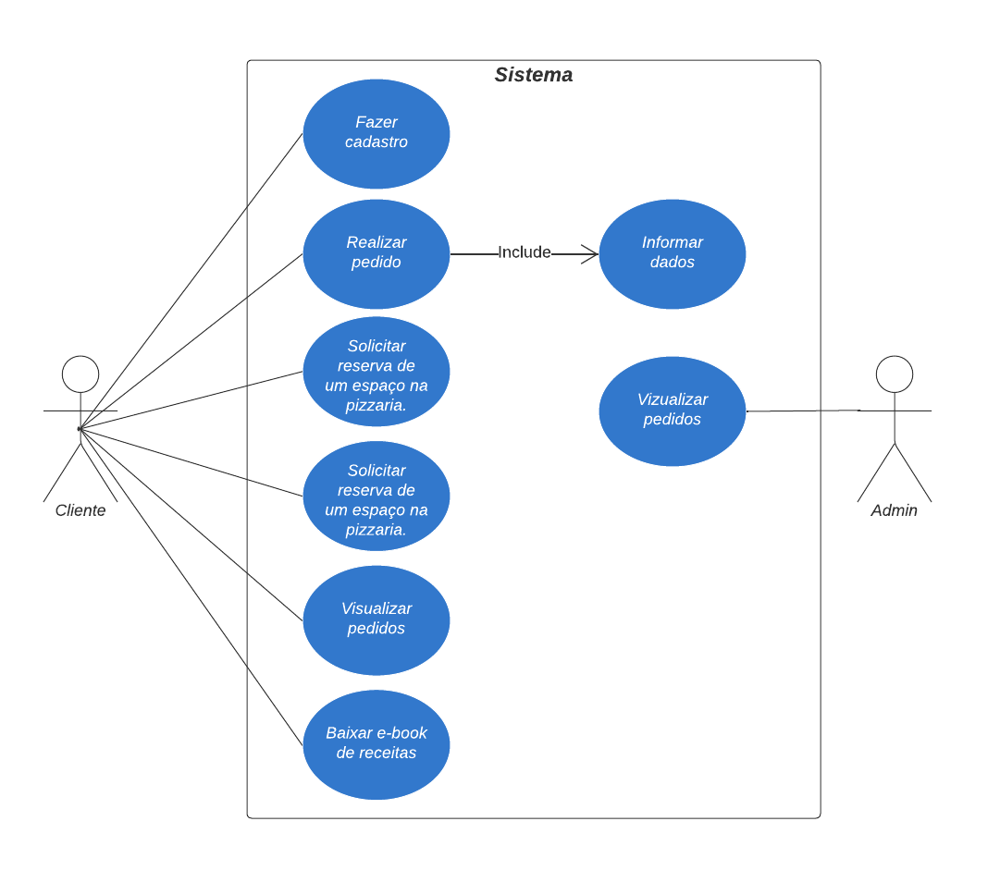
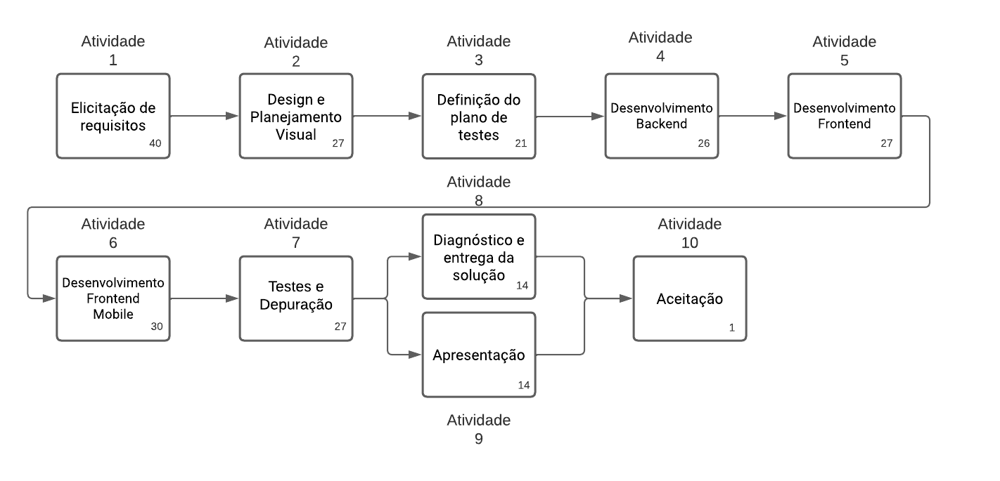
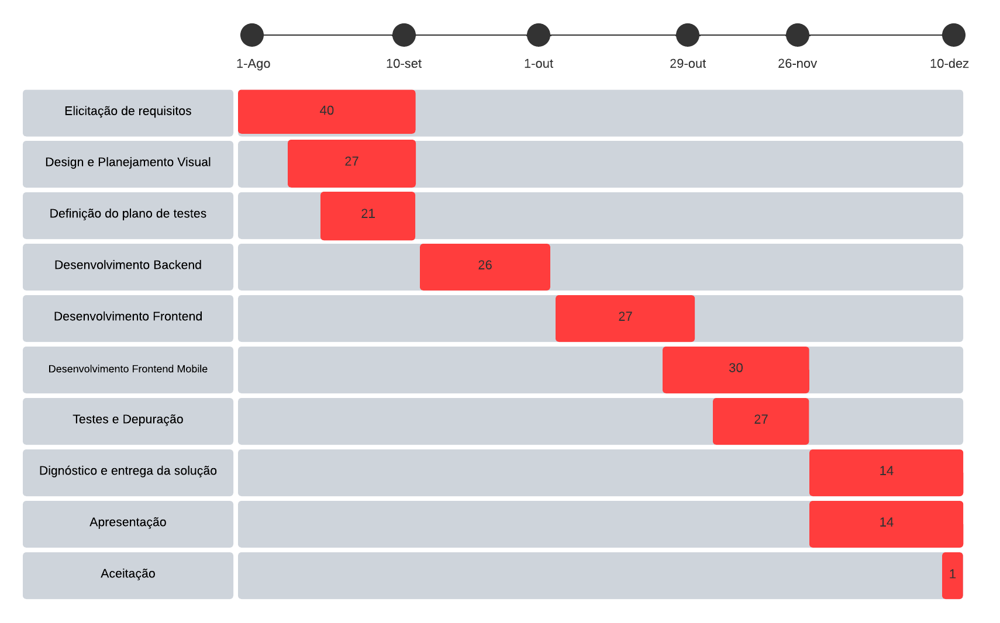
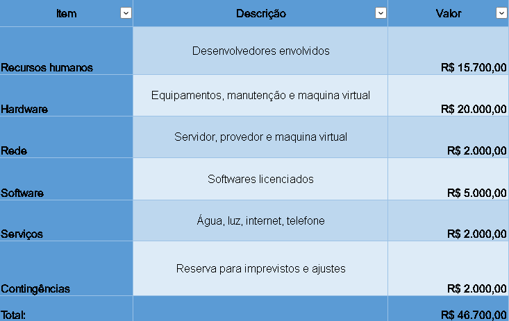

# Especificações do Projeto

Definição do problema e ideia de solução a partir da perspectiva do usuário. É composta pela definição do  diagrama de personas, histórias de usuários, requisitos funcionais e não funcionais além das restrições do projeto.

## Personas

|Claudio Guimaraes    | Informações:                       |                                        |
|--------------------|------------------------------------|----------------------------------------|
| | **Idade:** 32   **Ocupação:** Empresario | **Aplicativos:**   ⦁ Facebook   ⦁ Netflix   ⦁ Instagram   ⦁ WhatsApp 
| **Motivações:**    ⦁ Aumentar o alcance de sua pizzaria.   ⦁ Ter um valor mais justo em seus produtos.   ⦁ Mostrar um pouco da cultura de sua Pizzaria ao seu público.
|**Frustrações:**  ⦁ Cansado das taxas cobradas em aplicativos.   ⦁ Dificuldade em ter visibilidade em sua pizzaria.
|**Hobbies**   ⦁ Estudar   ⦁ Lazer com a família   ⦁ Viajar   ⦁ Estudar sobre investimentos |

|Fernando Arquino    | Informações:                       |                                        |
|--------------------|------------------------------------|----------------------------------------|
|| **Idade:** 46   **Ocupação:** Pizzaiolo | **Aplicativos:**   ⦁ Facebook   ⦁ Instagram   ⦁ TikTok   ⦁ WhatsApp 
| **Motivações:**   ⦁ Divulgar seu trabalho.   ⦁ Mostrar um pouco de sua culinária.
| **Frustrações:**   ⦁ Não consegue descrever seu trabalho com os aplicativos tradicionais.
|  **Hobbies**   ⦁ Cozinhar   ⦁ Brincar com seus filhos   ⦁ Leitura |

|Lucas Arthur   | Informações:                       |                                        |
|--------------------|------------------------------------|----------------------------------------|
|| **Idade:** 21   **Ocupação:** Estudante | **Aplicativos:**   ⦁ Facebook   ⦁ Instagram   ⦁ TikTok   ⦁ WhatsApp   ⦁ Youtube
| **Motivações:**   ⦁ Conhecer uma boa pizzaria. ⦁ Busca qualidade com preço justo.
| **Frustrações:**  ⦁ Cansado da limitação dos outros aplicativos.   ⦁ Não consegue escolher a pizza baseado em somente fotos e ingredientes.
|  **Hobbies**   ⦁ Jogar video-games   ⦁ Passear com cachorro   ⦁ Assistir séries e desenhos |

|Grabriel Alcantra   | Informações:                       |                                        |
|--------------------|------------------------------------|----------------------------------------|
|| **Idade:** 32   **Ocupação:** Escritor | **Aplicativos:**   ⦁ Instagram   ⦁ WhatsApp    ⦁ Twitter   ⦁ Youtube 
| **Motivações:**   ⦁ Busca detalhes sobre a pizza que irá comprar. ⦁ Procura uma experiencia diferente da convêncional para comprar pizzas.
| **Frustrações:**   ⦁ Gostaria de maior praticidade para encontrar restaurantes.
|  **Hobbies**   ⦁ Degustar Vinhos   ⦁ Degustar Massas   ⦁ Ler |

<!-- 
Enumere e detalhe as personas da sua solução. Para tanto, baseie-se tanto nos documentos disponibilizados na disciplina e/ou nos seguintes links:

> **Links Úteis**:
> - [Rock Content](https://rockcontent.com/blog/personas/)
> - [Hotmart](https://blog.hotmart.com/pt-br/como-criar-persona-negocio/)
> - [O que é persona?](https://resultadosdigitais.com.br/blog/persona-o-que-e/)
> - [Persona x Público-alvo](https://flammo.com.br/blog/persona-e-publico-alvo-qual-a-diferenca/)
> - [Mapa de Empatia](https://resultadosdigitais.com.br/blog/mapa-da-empatia/)
> - [Mapa de Stalkeholders](https://www.racecomunicacao.com.br/blog/como-fazer-o-mapeamento-de-stakeholders/)
>
Lembre-se que você deve ser enumerar e descrever precisamente e personalizada todos os clientes ideais que sua solução almeja.
-->

## Histórias de Usuários

## 📚 Histórias de Usuários

Com base na análise das personas forma identificadas as seguintes histórias de usuários:

|EU COMO... `PERSONA`| QUERO/PRECISO ... `FUNCIONALIDADE` |PARA ... `MOTIVO/VALOR`                       |
|--------------------|------------------------------------|----------------------------------------------|
|Claudio Guimaraes   | Aumentar o alcance de sua pizzaria                              | Aumentar seus lucros.                         |
|Claudio Guimaraes   | Mostrar um pouco da cultura de sua Pizzaria ao seu público.     | Ter uma maior conexão com seus clientes. |
|Claudio Guimaraes   | Ter um valor mais justo em seus produtos.                       | Gerar maior satisfação para seus clientes. |
|Fernando Arquino    | Mostrar um pouco de sua culinária.                              | Divulgar seu trabalho.  |
|Lucas Arthur        | Qualidade com preço justo.                                      | Poupar por conta de sua faculdade.  |
|Lucas Arthur        | Uma boa descrição sobre o estabelecimento.                      | Sentir maior segurança na compra.  |
|Grabriel Alcantra   | Uma experiencia diferente da convêncional para comprar pizzas.  | Para encontrar a pizzaria ideal. |
|Grabriel Alcantra   | Busca detalhes sobre a pizza que irá comprar.                   | Entender mais sobre o que será consumido antes da compra. |

## Modelagem do Processo de Negócio 

### Análise da Situação Atual

O projeto tem como proposta criar um site mais acertivo e direcionado para fidelização do cliente. 

### Descrição Geral da Proposta

No BPMN abaixo é possível verificar as rotas que serão desenvolvidas no decorrer do trabalho, desde realizar um pedido a reservar mesa disponível

## Indicadores de Desempenho

Apresente aqui os principais indicadores de desempenho e algumas metas para o processo. Atenção: as informações necessárias para gerar os indicadores devem estar contempladas no diagrama de classe. Colocar no mínimo 5 indicadores. 

| INDICADOR | OBJETIVOS | DESCRIÇÃO | CÁLCULO | FONTE DE DADOS | PERSPECTIVA |
|-----------|-----------|-----------|---------|----------------|-------------|
|Número de acessos ao site | Avaliar número de acessos a versão web da solução |  Verificar número de acessos únicos ao site | Número de acessos  | Google Analytics | Difusão do Produto | 
|Número de downloads do aplicativo | Avaliar quantidade de pessoas que baixaram e utilizam a versão mobile da solução | Verificar quantidade de downloads do aplicativo | Número de downloads | Play Store, Apple Store | Difusão do Produto | 
|Quantidade de vendas realizadas na plataforma | Avaliar sucesso na realização de vendas na plataforma | Verificar quantidade de vendas | Quantidade de vendas | Banco de dados da plataforma | Qualidade do Produto | 
|Percentual de reclamações Web | Avaliar índice de reclamações e respondê-las para identificar possível erros e promovor melhorias no sistema | Verificar reclamações recebidas | Razão entre o número de reclamações e quantidade de acessos únicos ao site | Formulário de Contato | Qualidade do Produto | 
|Percentual de reclamações aplicativo | Avaliar índice de reclamações e respondê-las para identificar possível erros e promovor melhorias no sistema | Verificar reclamações recebidas | Razão entre o número de reclaamções e quantidade de downloads do aplicativo | Play Store, Apple Store, Formulário de Contato | Qualidade do Produto |. 

## 🎯 Requisitos

As tabelas que se seguem apresentam os requisitos funcionais e não funcionais que detalham o escopo do projeto. Para determinar a prioridade de requisitos, aplicar uma técnica de priorização de requisitos e detalhar como a técnica foi aplicada.

### Requisitos Funcionais

|ID    | Descrição do Requisito  | Prioridade |
|------|-----------------------------------------|----|
|RF-001| O sistema deverá exibir todas as pizzas disponíveis para compra. | ALTA |
|RF-002| O sistema deverá ter um carrinho de compras para que o usuário possa adicionar, remover itens, e, além disso seja possível exibir o resumo do pedido, assim como o total a pagar  | ALTA | 
|RF-003| O sistema deverá permitir ao usuário realizar seu cadastro informando: nome, senha, email  | ALTA | 
|RF-004| O sistema deverá informar ao cliente que seu pedido foi concluido com sucesso.  | MÉDIO | 
|RF-005| O sistema deverá informar ao usuário os ingredientes de cada pizza | ALTA |
|RF-006| O sistema deverá permitir ao usuário acessar o mapa com a localização da pizzaria |  BAIXA |
|RF-007| O sistema deverá permitir ao usuário baixar um e-book com as receitas de algumas pizzas disponibilizadas |  MEDIO |
|RF-008| O sistema deverá permitir ao usuário solicitar reserva de mesa caso ele queira consumir no local, informando: nome, quantidade de pessoas, data, horário da reserva e dados para contato (telefone e email). |  MEDIO |
|RF-009| O sistema deverá enviar as solicitações das reservas para o email da pizzaria, com os dados informados pelo cliente. |  MEDIO | 
|RF-010| O sistema deverá permitir ao usuário selecionar suas pizzas favoritas, colocando-as em uma guia separada para que possa acessa-las com maior facilidade |  BAIXA |
|RF-011| O sistema deverá permitir ao usuário solicitar reserva de uma area do estabelecimento, para confraternização, seja para empresa, aniversário e/ou casamento. Informando: nome, quantidade de pessoas, tipo de evento, data, horário da reserva e dados para contato (telefone e email).  |  BAIXA |

### ⚠️ Observação de RFs
| Nº RFs   | Observação  | 
|------|-----------------------------------------|
|009 - 010 - 011  | A disponibilidade será gerenciada pela pizzaria. Após o cliente enviar o pedido de reserva, a solicitação chegará no email da pizzaria. Sendo ela responsável por analisar se o horário está disponivel e retornar ao cliente -email padrão gmail. Dessa forma, o sistema não terá uma versão/guia/ou similares, onde o proprio sistema consulte a disponibilidade de mesas e horarios.|

### Requisitos não Funcionais

|ID     | Descrição do Requisito  |Prioridade |
|-------|-------------------------|----|
|RNF-001| A versão Web deverá ser responsivo | MÉDIA | 
|RNF-002| Tanto a versão Web quanto a versão Mobile devem apresentar bom nível de contraste visando a usabilidade |  ALTA | 
|RNF-003| Os sistemas devem funcionar todos os dias da semana | ALTA | 
|RNF-004| Deve processar requisições do usuário em no máximo 3s |  MEDIA | 
|RNF-005| Visando a usabilidade, os sistemas Web e Mobile devem ser intuitivos. O usuário deverá reconhecer cada funcionalidade | ALTA | 
|RNF-006| O sistema deve se manter operando mesmo que haja 100 usuários em atividade |  ALTA |

## Restrições

O projeto está restrito pelos itens apresentados na tabela a seguir.

|ID| Restrição                                             |
|--|-------------------------------------------------------|
|01| O projeto deverá ser entregue até o final do semestre |
|02|A equipe não pode subcontratar o desenvolvimento do trabalho |

Enumere as restrições à sua solução. Lembre-se de que as restrições geralmente limitam a solução candidata.

> **Links Úteis**:
> - [O que são Requisitos Funcionais e Requisitos Não Funcionais?](https://codificar.com.br/requisitos-funcionais-nao-funcionais/)
> - [O que são requisitos funcionais e requisitos não funcionais?](https://analisederequisitos.com.br/requisitos-funcionais-e-requisitos-nao-funcionais-o-que-sao/)

## Diagrama de Casos de Uso

O diagrama de casos de uso é o próximo passo após a elicitação de requisitos, que utiliza um modelo gráfico e uma tabela com as descrições sucintas dos casos de uso e dos atores. Ele contempla a fronteira do sistema e o detalhamento dos requisitos funcionais com a indicação dos atores, casos de uso e seus relacionamentos. 

# Matriz de Rastreabilidade

A matriz de rastreabilidade é uma ferramenta usada para facilitar a visualização dos relacionamento entre requisitos e outros artefatos ou objetos, permitindo a rastreabilidade entre os requisitos e os objetivos de negócio. 

A matriz deve contemplar todos os elementos relevantes que fazem parte do sistema, conforme a figura meramente ilustrativa apresentada a seguir.

# Gerenciamento de Projeto

De acordo com o PMBoK v6 as dez áreas que constituem os pilares para gerenciar projetos, e que caracterizam a multidisciplinaridade envolvida, são: Integração, Escopo, Cronograma (Tempo), Custos, Qualidade, Recursos, Comunicações, Riscos, Aquisições, Partes Interessadas. Para desenvolver projetos um profissional deve se preocupar em gerenciar todas essas dez áreas. Elas se complementam e se relacionam, de tal forma que não se deve apenas examinar uma área de forma estanque. É preciso considerar, por exemplo, que as áreas de Escopo, Cronograma e Custos estão muito relacionadas. Assim, se eu amplio o escopo de um projeto eu posso afetar seu cronograma e seus custos.

O gráfico de Gantt ou diagrama de Gantt também é uma ferramenta visual utilizada para controlar e gerenciar o cronograma de atividades de um projeto. Com ele, é possível listar tudo que precisa ser feito para colocar o projeto em prática, dividir em atividades e estimar o tempo necessário para executá-las.

## Gerenciamento de Equipe
<!--O gerenciamento adequado de tarefas contribuirá para que o projeto alcance altos níveis de produtividade. Por isso, é fundamental que ocorra a gestão de tarefas e de pessoas, de modo que os times envolvidos no projeto possam ser facilmente gerenciados. 

 -->
### Trello

Etiquetas: Apresenta o tipo daquele produto no desenvolvimento Elas são dividias (até o momento 03/03/23) em:
* Documentação
* Desenvolvimento
* Desenvolvimento RNF
* Arquitetura
* Teste

Cor: As cores é para a equipe de desenvolvimento saber qual é o nível do atributo Prioridade
Elas são dividas em:
* Vermelho: Prioridade Alta
* Amarelo: Prioridade Média
* Azul: Prioridade Baixa

## Gestão de Orçamento

* Recursos Humanos: Considerando um grupo de desenvolvedores trabalhando por 1h por dia, 5 dias por semana até a conclusão do projeto (23/06/23 -> 74 dias úteis). Cada um com o custo de R$30,00/hora. Obs: Todos os papéis Do Scrum estão dentro desse time. 
* Os custos de hardware são aqueles de depreciação, manutenção dos equipamentos dos colaboradores, bem como o custo de uma máquina virtual para armazenamento de arquivos e realização de testes. 
* Os custos de rede são aqueles necessários para realização do projeto, não levando em conta a manutenção do mesmo após entrega do produto, que será por conta do cliente que o comercializará. 
* Softwares considerados foram aqueles instalados nas máquinas dos funcionários para realização do projeto 
* Serviços indiretos considerados foram: água, luz, internet, telefone. Serviços terceirizados diretos não estão previstos. 
* As contigências garante que alguns imprevistos que geram custos sejam resolvidos através dessa reserva. 

