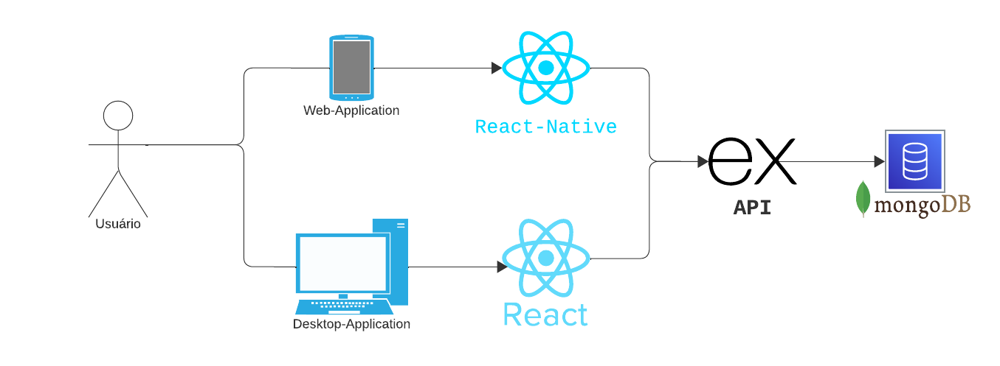
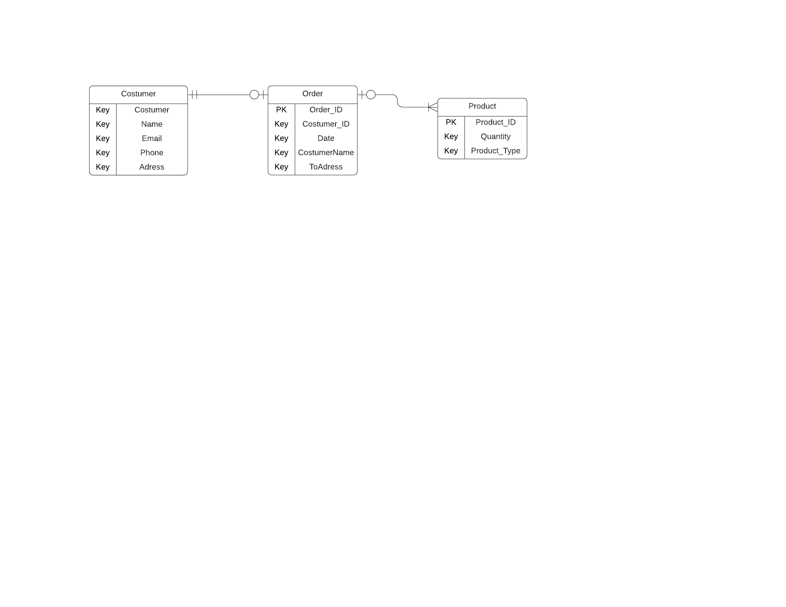

# Arquitetura da Solução

Pré-requisitos: <a href="3-Projeto de Interface.md"> Projeto de Interface</a>

Definição de como o software é estruturado em termos dos componentes que fazem parte da solução e do ambiente de hospedagem da aplicação.

## Diagrama de Classes

O diagrama de classes ilustra graficamente como será a estrutura do software, e como cada uma das classes da sua estrutura estarão interligadas. Essas classes servem de modelo para materializar os objetos que executarão na memória.

## Modelo ER

O Modelo ER representa através de um diagrama como as entidades (coisas, objetos) se relacionam entre si na aplicação interativa.]

## Modelo Físico

Entregar um arquivo banco.sql contendo os scripts de criação das tabelas do banco de dados. Este arquivo deverá ser incluído dentro da pasta src\bd.

## Tecnologias Utilizadas

Estamos utilizando as seguintes tecnologias e ferramentas para implementar nossa solução:

**1- Banco de Dados NoSQL: MongoDB é a tecnologia de banco de dados NoSQL selecionada para armazenar e gerenciar nossos dados, proporcionando flexibilidade na modelagem de dados.**

**2 - Desenvolvimento de Aplicativo Móvel: Estamos utilizando o framework **React-Native** para o desenvolvimento da interface do usuário e lógica de nosso aplicativo móvel, permitindo a criação de aplicativos multiplataforma eficientes.**

**3 - API: Para criação da api utilizamos o **Express**, facilitando a implantação e a execução em diferentes ambientes.**

**4 - Desenvolvimento Web: Para desenvolver a interface web da aplicação, empregamos o framework **React** para criar uma experiência de usuário atraente e interativa.**

**5 - Ambiente de Desenvolvimento Integrado (IDE): A plataforma Visual Studio code é nossa escolha para o desenvolvimento de código, oferecendo um ambiente robusto e suporte a várias linguagens de programação.**

Essas tecnologias e ferramentas foram selecionadas com base nas necessidades específicas do projeto, visando a eficiência no desenvolvimento, flexibilidade de modelagem de dados e capacidade de escala à medida que o projeto evolui.

## Hospedagem

Optamos por desenvolver um projeto com acesso exclusivamente local, sem a necessidade de hospedagem em plataformas externas. Essa abordagem simplifica a implementação e manutenção, permitindo-nos adaptar o sistema às especificidades do ambiente operacional, sem depender de recursos externos, garantindo assim, uma solução robusta.

## Qualidade de Software

Após análise da norma ISSO/IEC 9126, definimos que as subcaracterísticas que utilizaremos como base para nortear o desenvolvimento do nosso projeto de software são: adequação, acurácia, tolerância a falhas, comportamento em relação ao tempo e estabilidade. Tais características foram escolhidas por se adequarem as expectativas em relação ao projeto quando analisadas no contexto da regra de negócio. A métricas para adequação e acurácia serão as avaliações feitas por usuários, sendo eles clientes ou donos do negócio, em relação as funcionalidades do sistema e seus resultados. Os demais itens, serão medidos através de testes de software realizados pela equipe de desenvolvimento. 
