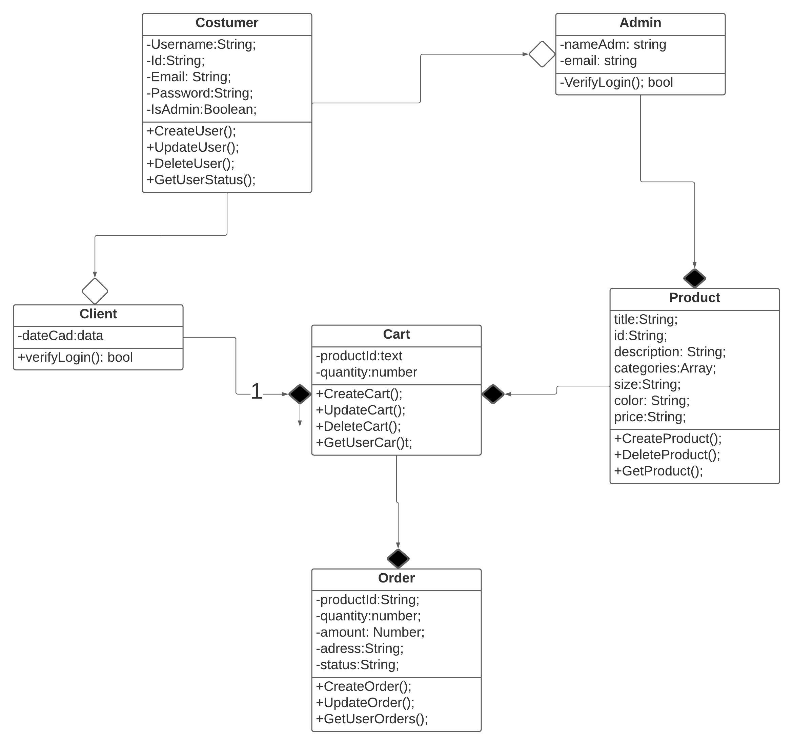
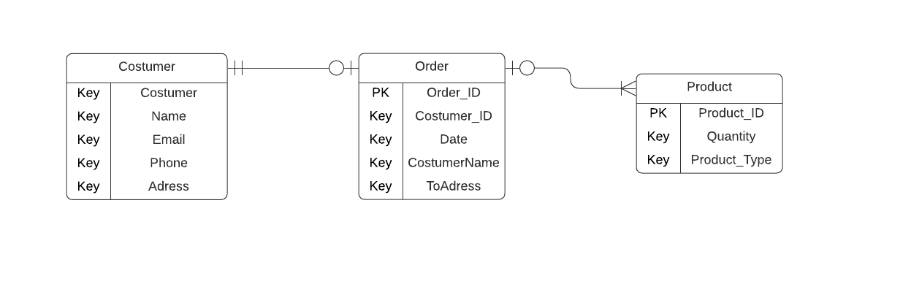

# Arquitetura da Solução

Pré-requisitos: <a href="3-Projeto de Interface.md"> Projeto de Interface</a>

Definição de como o software é estruturado em termos dos componentes que fazem parte da solução e do ambiente de hospedagem da aplicação.

## Diagrama de Classes

O diagrama de classes ilustra graficamente como será a estrutura do software, e como cada uma das classes da sua estrutura estarão interligadas. Essas classes servem de modelo para materializar os objetos que executarão na memória.

## Modelo ER

O Modelo ER representa através de um diagrama como as entidades (coisas, objetos) se relacionam entre si na aplicação interativa.]

## Esquema Relacional

O Esquema Relacional corresponde à representação dos dados em tabelas juntamente com as restrições de integridade e chave primária.
 

## Modelo Físico

Entregar um arquivo banco.sql contendo os scripts de criação das tabelas do banco de dados. Este arquivo deverá ser incluído dentro da pasta src\bd.

## Tecnologias Utilizadas

Estamos utilizando as seguintes tecnologias e ferramentas para implementar nossa solução:

**1- Banco de Dados NoSQL: MongoDB é a tecnologia de banco de dados NoSQL selecionada para armazenar e gerenciar nossos dados, proporcionando flexibilidade na modelagem de dados.**

**2 - Desenvolvimento de Aplicativo Móvel: Estamos utilizando o framework **React-Native** para o desenvolvimento da interface do usuário e lógica de nosso aplicativo móvel, permitindo a criação de aplicativos multiplataforma eficientes.**

**3 - API: Para criação da api utilizamos o **Express**, facilitando a implantação e a execução em diferentes ambientes.**

**4 - Desenvolvimento Web: Para desenvolver a interface web da aplicação, empregamos o framework **React** para criar uma experiência de usuário atraente e interativa.**

**5 - Ambiente de Desenvolvimento Integrado (IDE): A plataforma Visual Studio code é nossa escolha para o desenvolvimento de código, oferecendo um ambiente robusto e suporte a várias linguagens de programação.**

Essas tecnologias e ferramentas foram selecionadas com base nas necessidades específicas do projeto, visando a eficiência no desenvolvimento, flexibilidade de modelagem de dados e capacidade de escala à medida que o projeto evolui.

## Hospedagem

Optamos por desenvolver um projeto com acesso exclusivamente local, sem a necessidade de hospedagem em plataformas externas. Essa abordagem simplifica a implementação e manutenção, permitindo-nos adaptar o sistema às especificidades do ambiente operacional, sem depender de recursos externos, garantindo assim, uma solução robusta.

## Qualidade de Software

Conceituar qualidade de fato é uma tarefa complexa, mas ela pode ser vista como um método gerencial que através de procedimentos disseminados por toda a organização, busca garantir um produto final que satisfaça às expectativas dos stakeholders.

No contexto de desenvolvimento de software, qualidade pode ser entendida como um conjunto de características a serem satisfeitas, de modo que o produto de software atenda às necessidades de seus usuários. Entretanto, tal nível de satisfação nem sempre é alcançado de forma espontânea, devendo ser continuamente construído. Assim, a qualidade do produto depende fortemente do seu respectivo processo de desenvolvimento.

A norma internacional ISO/IEC 25010, que é uma atualização da ISO/IEC 9126, define oito características e 30 subcaracterísticas de qualidade para produtos de software.
Com base nessas características e nas respectivas sub-características, identifique as sub-características que sua equipe utilizará como base para nortear o desenvolvimento do projeto de software considerando-se alguns aspectos simples de qualidade. Justifique as subcaracterísticas escolhidas pelo time e elenque as métricas que permitirão a equipe avaliar os objetos de interesse.

> **Links Úteis**:
>
> - [ISO/IEC 25010:2011 - Systems and software engineering — Systems and software Quality Requirements and Evaluation (SQuaRE) — System and software quality models](https://www.iso.org/standard/35733.html/)
> - [Análise sobre a ISO 9126 – NBR 13596](https://www.tiespecialistas.com.br/analise-sobre-iso-9126-nbr-13596/)
> - [Qualidade de Software - Engenharia de Software 29](https://www.devmedia.com.br/qualidade-de-software-engenharia-de-software-29/18209/)
